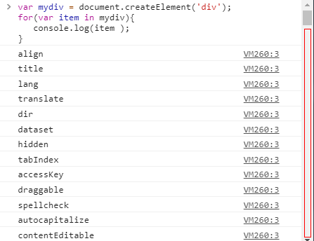

## 1.概述
在面试Vue开发的时候呢总是会被问到Vue的vdom和diff算法，但是看了源码的patch.js估计也是很抽象，所以呢在这里就结合Vue源码和其他人对这方面的理解，整理了这部分出来。  
如果不了解virtual dom，要理解diff的过程是比较困难的。虚拟dom对应的是真实dom，使用document.CreateElement和document.CreateTextNode创建的就是真实节点。vue2.0才开始使用了virtual dom，有向react靠拢的意思。

## 2.虚拟dom
在说虚拟dom之前，我们先打印真实dom看看：
```javascript
var mydiv = document.createElement('div');
for(var item in mydiv){
   console.log(item );
}
```

> 真实dom的属性是很复杂的，如果每次改变前都生成新的dom元素会消耗大量内存。

**到底什么是virtual dom呢？通俗易懂的来说就是用一个简单的对象去代替复杂的dom对象。**