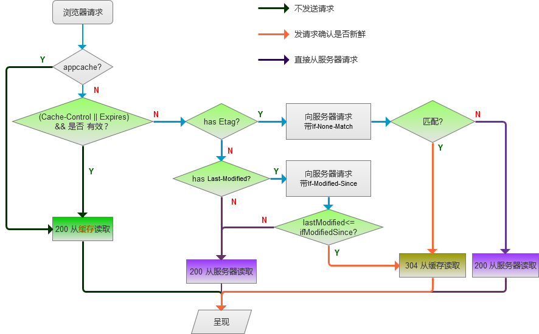

### 1.http协议的缓存机制
http缓存机制可以有很多设置，比如：html5 appcache，Expires，Cache-control，Last-Modified/If-Modified-Since，Etag/If-None-Match等等，单个特性还能知道一点，但这几个特性一起再配合浏览器的行为之后就很懵逼了......  

对http请求来说，客户端缓存分三类：  
1. 不发任何请求，直接从缓存中取数据，代表的特性有： Expires ，Cache-Control=<number！=0>和appcache  
2. 发请求确认是否新鲜，再决定是否返回304并从缓存中取数据 :代表的特性有：Last-Modified/If-Modified-Since，Etag/If-None-Match  
3. 直接发送请求， 没有缓存，代表的特性有：Cache-Control：max-age=0/no-cache  

各种缓存的判断优先级如下图  

### 2.Cache-control

|Cache-directive|说明|
|:------|:-----|
|public|所有内容都将被缓存(客户端和代理服务器都可缓存)|
|private|内容只缓存到私有缓存中(仅客户端可以缓存，代理服务器不可缓存)|
|no-cache|必须先与服务器确认返回的响应是否被更改，然后才能使用该响应来满足后续对同一个网址的请求。因此，如果存在合适的验证令牌 (ETag)，no-cache 会发起往返通信来验证缓存的响应，如果资源未被更改，可以避免下载。|
|no-store|所有内容都不会被缓存到缓存或 Internet 临时文件中|
|must-revalidation/proxy-revalidation|如果缓存的内容失效，请求必须发送到服务器/代理以进行重新验证|
|max-age=xxx (xxx is numeric)|缓存的内容将在 xxx 秒后失效, 这个选项只在HTTP 1.1可用, 并如果和Last-Modified一起使用时, 优先级较高|

|操作|结果|
|:------|:-----|
|打开新窗口|如果指定cache-control的值为private、no-cache、must-revalidate,那么打开新窗口访问时都会重新访问服务器。而如果指定了max-age值,那么在此值内的时间里就不会重新访问服务器,例如：Cache-control: max-age=5 表示当访问此网页后的5秒内不会去再次访问服务器.|
|在地址栏回车|如果值为private或must-revalidate,则只有第一次访问时会访问服务器,以后就不再访问。如果值为no-cache,那么每次都会访问。如果值为max-age,则在过期之前不会重复访问。|
|按后退按扭|如果值为private、must-revalidate、max-age,则不会重访问,而如果为no-cache,则每次都重复访问.|
|按刷新按扭|无论为何值,都会重复访问.|
 
